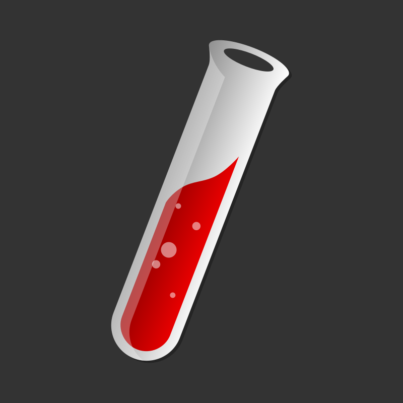

## Welcome to Gyurim’s GitHub  

<!-- <h1>  Welcome to the 1000% immersive space for new developers!</h1> -->

 
 
[](mailto:gyurim26@gmail.com)
<p align="left">  </p> 
 
<!-- 
<div style="text-align: right">There are 10 types of people in the world. Those who get Binary and those who don't.. </div>
-->   
 


## :computer: Technologies I Love  -->
 * Frontend and Backend Web Development
 * Data Science
 * Machine Learning
 

## 🚀 My Blog
- [Lia의 개발 블로그🔥 보러가기](https://rialeee.github.io/)
  

## Programming Languages
<div align="left">
<a href="https://www.java.com" target="_blank" rel="noreferrer">
</a>
<a href="https://developer.mozilla.org/en-US/docs/Web/JavaScript" target="_blank" rel="noreferrer">
</a>
<a href="https://www.python.org" target="_blank" rel="noreferrer">
</a>
<a href="https://www.w3.org/html/" target="_blank" rel="noreferrer">
</a>
<a href="https://www.w3schools.com/css/" target="_blank" rel="noreferrer">
 </a>
</div>

## Frameworks & Libraries
<div align="left">
<a href="https://reactjs.org/" target="_blank" rel="noreferrer">
</a>
<a href="https://spring.io/" target="_blank" rel="noreferrer">
</a>
<a href="https://fastapi.tiangolo.com/" target="_blank" rel="noreferrer">
</a>
<a href="https://www.tensorflow.org" target="_blank" rel="noreferrer">
</a>
<a href="https://pandas.pydata.org/" target="_blank" rel="noreferrer">
</a>
</div>

## Development & Design Tools
<div align="left">
<a href="https://git-scm.com/" target="_blank" rel="noreferrer">
</a>
<a href="https://github.com/" target="_blank" rel="noreferrer">
</a>
<a href="https://www.docker.com/" target="_blank" rel="noreferrer">
</a>
<a href="https://postman.com" target="_blank" rel="noreferrer">
</a>
<a href="https://code.visualstudio.com/" target="_blank" rel="noreferrer">
</a>
<a href="https://www.jetbrains.com/pycharm/download/?section=windows/" target="_blank" rel="noreferrer">
</a>
<a href="https://www.anaconda.com/" target="_blank" rel="noreferrer">
</a>
<a href="https://www.figma.com/" target="_blank" rel="noreferrer">
</a>
</div>

## Databases & Servers
<div align="left">
<a href="https://www.oracle.com/" target="_blank" rel="noreferrer">
</a>
<a href="https://aws.amazon.com" target="_blank" rel="noreferrer">
</a>
<a href="https://www.nginx.com" target="_blank" rel="noreferrer">
</a>
</div>

## Other Technologies
<div align="left">
<a href="https://www.linux.org/" target="_blank" rel="noreferrer">
</a>
<a href="https://getbootstrap.com" target="_blank" rel="noreferrer">
</a>
<a href="https://mui.com/" target="_blank" rel="noreferrer">
</a>
<a href="https://jekyllrb.com/" target="_blank" rel="noreferrer">
</a>
 <a href="https://nodejs.org" target="_blank" rel="noreferrer">
</a>
</div>


  ## Who am I?
 ```python
 class WhoAmI:
 	user = 'Lee Gyu Rim'
		current_work = 'Preparing for certification & studying code'
		hobbies = [
				'Running',
				'Watching Marvel movies',
				'Listening to music loudly'
		  	]
		nickname = 'Debugger'

 	def ambitions(self):
        		self.obtain_certification()
      	  	self.create_easy_maintenance_sw()
      	  	self.achieve_my_git_fork_a_lot()
       	 	# Deadline: Somewhere in 2034 :)

    	def obtain_certification(self):
        		print("Possessing 5 or more coding-related certifications...")

    	def create_easy_maintenance_sw(self):
        		print("Elaborating initial construction")
        		print("In addition to providing readable code guidance...")

    	def achieve_my_git_fork_a_lot(self):
        		print("Achieving my Git fork to over 10,000...")
 ```


## Github Stats
 
 


